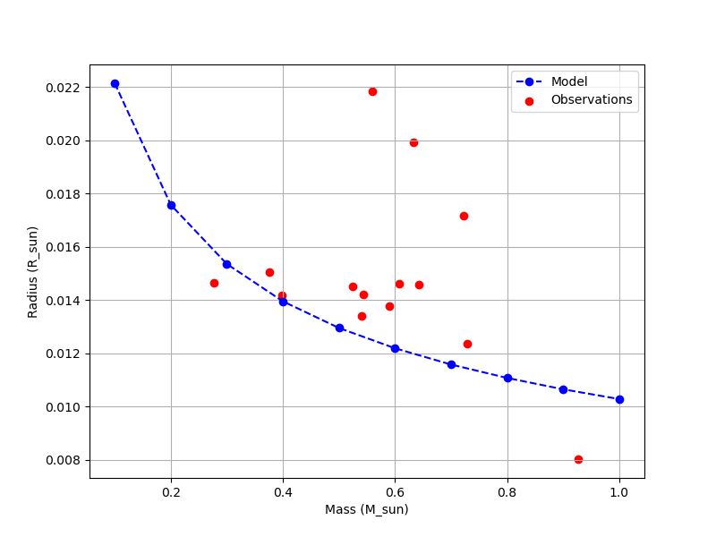

# AST 304 — Orbits & White Dwarf Structure

 

Team projects (Team 6: Agrim, Patrick and Siddak) building numerical astrophysics models in Python with unit tests.

**Course:** AST 304  
**Term:** Fall 2024  
**Institution:** Michigan State University

## Highlights

- **White dwarf structure:** integrates the stellar-structure equations with a degenerate-electron equation of state using RK4, computes the mass–radius relation, and compares it with observed white dwarfs (Joyce et al. 2018; Provencal et al.).
- **Kepler orbits:** forward Euler, RK2 and RK4 integrators with energy-error convergence analysis.
- Unit tests for the EOS and ODE solvers (`pytest`).

## Results



## Contents

- [`white_dwarf/structure.py`](white_dwarf/structure.py) — stellar-structure integration and mass–radius relation
- [`white_dwarf/eos.py`](white_dwarf/eos.py) — degenerate electron equation of state
- [`white_dwarf/ode.py`](white_dwarf/ode.py) — Euler / RK2 / RK4 integrators
- [`white_dwarf/observations.py`](white_dwarf/observations.py) — loader for observed white-dwarf masses and radii
- [`white_dwarf/test-structure.py`](white_dwarf/test-structure.py) — driver: runs the model and plots it against observations
- [`kepler_orbits/kepler_template.py`](kepler_orbits/kepler_template.py) — Kepler orbit integration
- [`kepler_orbits/energy_error.py`](kepler_orbits/energy_error.py) — energy-error convergence study
- [`homework/hw6.ipynb`](homework/hw6.ipynb) — homework 6

## Repository Structure

```text
ast304-stellar-structure/
├── homework/
│   └── hw6.ipynb
├── kepler_orbits/
│   ├── energy_error.py
│   ├── kepler_template.py
│   ├── ode_template.py
│   └── test_ode.py
├── white_dwarf/
│   ├── astro_const.py
│   ├── eos.py
│   ├── eos_table.txt
│   ├── Joyce.txt
│   ├── mass-radius-graph.png
│   ├── observations.py
│   ├── ode.py
│   ├── Provencal.txt
│   ├── structure.py
│   ├── test-structure.py
│   └── test_eos.py
├── LICENSE
├── README.md
└── requirements.txt
```

## Getting Started

```bash
pip install -r requirements.txt
cd white_dwarf && python test-structure.py   # mass, radius and comparison plot
pytest                                        # run unit tests
```

> **Academic integrity:** This repository contains my own submitted work for a university course and is shared as a portfolio sample. Assignment prompts and starter code belong to the course instructors. Current students should not copy this work.

## Author

**Siddak Marwaha**

## License

Code in this repository is released under the [MIT License](LICENSE). Course-provided prompts and materials remain the property of their authors.
